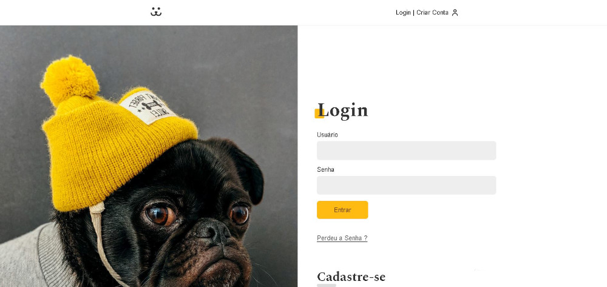

# Dogs

<!---Esses são exemplos. Veja https://shields.io para outras pessoas ou para personalizar este conjunto de escudos. Você pode querer incluir dependências, status do projeto e informações de licença aqui--->

> Rede social criada para os apaixonados por pets, você pode criar a conta do seu pet, postar fotos bem como comentar nas fotos de outros pets, se perder a conta poderá recuperar pelo codígo de recuperação enviado por email.

- **Obs:** Para facilitar o login já existe um usuário cadastrado com: 
- **nome:** dog 
- **senha:** dog

<h4 align="center"><a href="https://jefferson-guirra.github.io/-Projetos/projeto-02/" target="_blank">Clique para visitar o projeto</a></h4>

## 📚 Seções

O site é composto por quatro seções:

- **Home:** na home temos um feed inicial com fotos de usuários da rede.;
- **Login:** É a seção de criação, login ou recuperação de conta ( Função de Auto-Login inclusa);
- **Minha Conta:** Apresenta o feed de fotos postadas por você;
- **Estatísticas:** é mostrado as estaísticas da sua conta;
- **Poste sua Foto:** É aqui que você pode postar a foto do seu pet junto a suas informações;
- **Logout:** função de deslogar da conta.

---

## 🚀  Ferramentas usadas:

O projeto visou o aprendizado desde o básico ao avaçando de Reatcjs, Redux, React Router.

- HTML;
- Css;
- JavaScript;
- React;
- React Router;
- Redux;
- Victory ( biblioteca )

---

### Ajustes e melhorias

O projeto foi concluído e todas as tarefas finalizadas:

- [x] Tarefa 1
- [x] Tarefa 2
- [x] Tarefa 3
- [x] Tarefa 4
- [x] Tarefa 5

* Compatível `<Windows / Linux / Mac>`." alt="Doctor Care">

 

